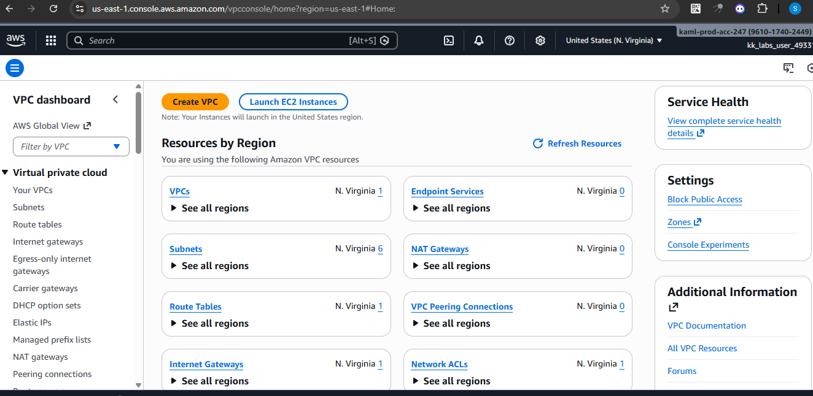
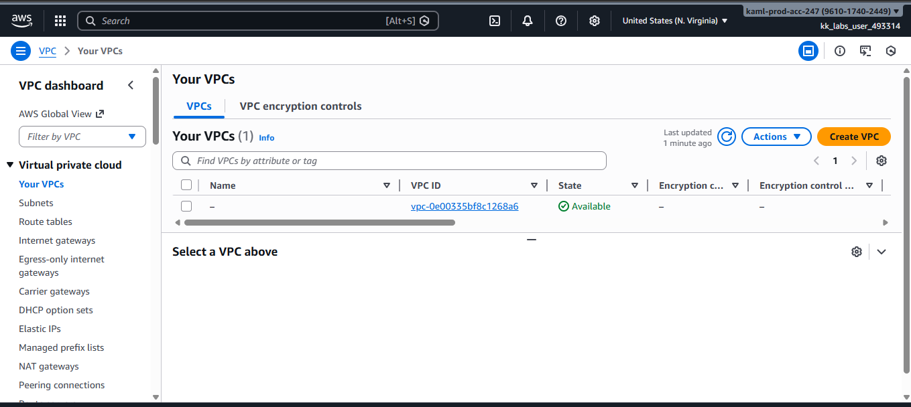
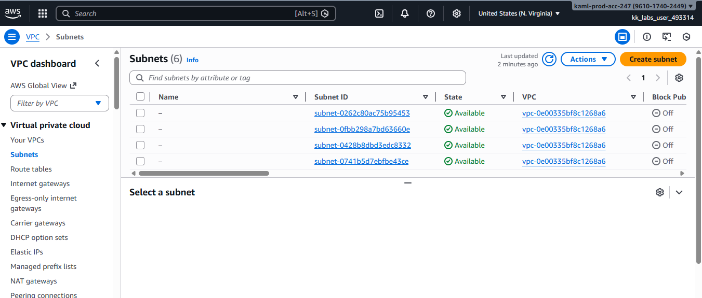
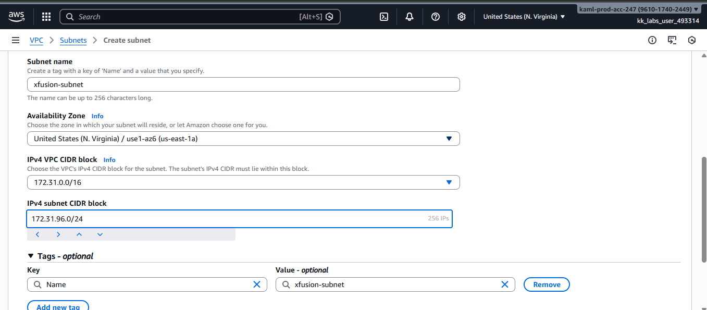
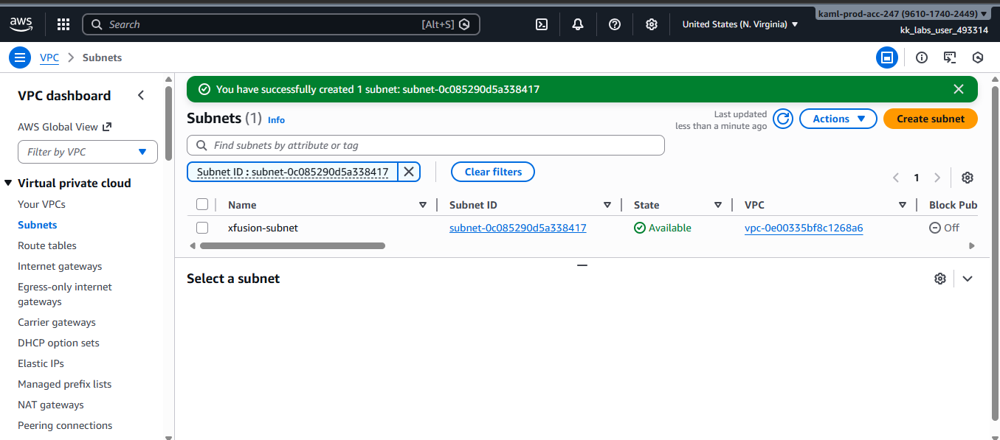

# AWS-subnet-creation-guide

This guide demonstrates how to create a subnet in the default VPC in AWS using the Management Console (GUI). Subnets are used to logically divide a VPC’s IP address range and organize cloud resources.

## Step 1: Log in to AWS Console

Navigate to the AWS Management Console and sign in using your credentials.

## Step 2: Navigate to the VPC Dashboard

1. In the Services menu, search for VPC.

2. Click VPC to open the VPC Dashboard.  

## Step 3: Identify the Default VPC

1. From the left-hand menu, click Your VPCs.

2. Locate the VPC marked Default = Yes.

This is the VPC where the subnet will be created.

## Step 4: Review Existing Subnets

1. From the left-hand menu, click Subnets.

2. Review the IPv4 CIDR blocks already assigned.

This step is important to ensure the new subnet does not overlap with existing subnets.

## Step 5: Create a New Subnet

1. Click the Create subnet button.

2. Fill in the details:

VPC: Default VPC

Subnet name: 

Availability Zone: 

IPv4 CIDR block: a non-overlapping range

3. Click Create subnet.

## Step 6: Verify Subnet Creation

1. After creation, confirm the subnet status is Available.

2. Verify the subnet is associated with the default VPC.

## Best Practices

• Always review existing subnet CIDR blocks before creating new ones to avoid IP overlap errors.

• Use meaningful subnet names to clearly identify their purpose.

• For incremental cloud migration, plan subnets ahead to support future workloads and network segmentation.
